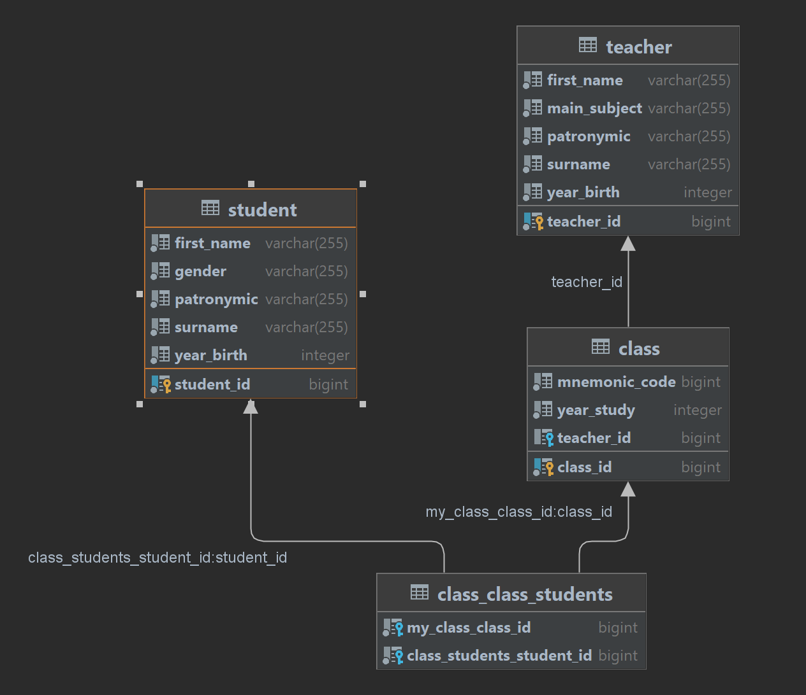

### Описание

WEB приложение по учету классов в школе.

#### Необходимые объекты учета: 
Ученики, учителя, классы.

#### Набор полей объекта Ученик: 
Фамилия, Имя, Отчество, год рождения, гендерная принадлежность.

#### Набор полей объекта Учитель: 
Фамилия, Имя, Отчество, год рождения, гендерная принадлежность, основной предмет.

#### Набор полей объекта Класс: 
Год обучения, мнемокод, Классный руководитель (ссылка на учителя), список учеников класса 
(ссылки на учеников).

WEB интерфейс должен позволять просматривать информацию об объектах учета в лайф гриде. Должна иметься возможность 
сортировок и отбора по любым из полей. Возможные действия над объектами учета - Добавление, размножение, удаление.

#### Используемые технологии
Java 11, Spring Boot, Lombok, JPA, Hibernate, PostgreSQL, H2, Maven, Apache Tomcat

Запускается на порту 8080. 
Имеет отдельную Базу Данных. 

#### Диаграмма БД основного сервиса
